# Modify Bleed Air Switch for 360° Travel

> Submitted by OpenHornet Contributor Randy “Exprezzo” Henrion.  
> Originally posted by Noctum on July 8, 2023.

The Bleed Air Knob Mechanism, `OH5A5A1-200`, requires a 4-position, 90° throw switch with continuous rotation. Unfortunately, a continuous rotation switch meeting this specification was obscenely expensive, so this tutorial modifies a cheaper version instead.

The switch used is the A12405RNZQ switch.

> [!CAUTION]
> Be careful, do not use too much force, and take your time. The small components inside are under spring force and will launch into the ether if you are not careful.

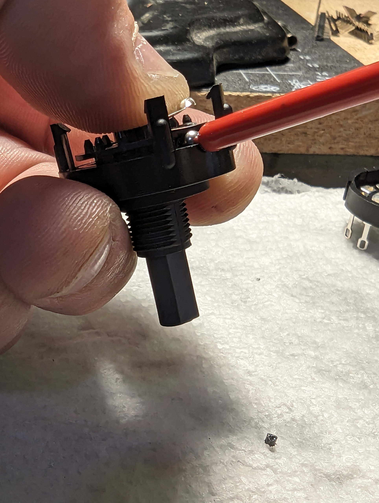

## Tools and Materials Required

1. [A12405RNZQ Switch](https://www.digikey.com/)
2. Small flat head screwdriver or other small prying tool
3. Small needle nose pliers
4. Tweezers
5. Flush cutters
6. Needle file

## Step 1: Housing Disassembly

While keeping the stem under tension and secured, open the housing by gently prying away the four clips on the bottom of the rotary switch.

Too much force applied to the plastic clip will cause it to break. Instead, gently push a clip toward the edge, about 25% of the way, and then move on to the next one. Keep doing this until all of the pins have clearance, and then separate the housing.

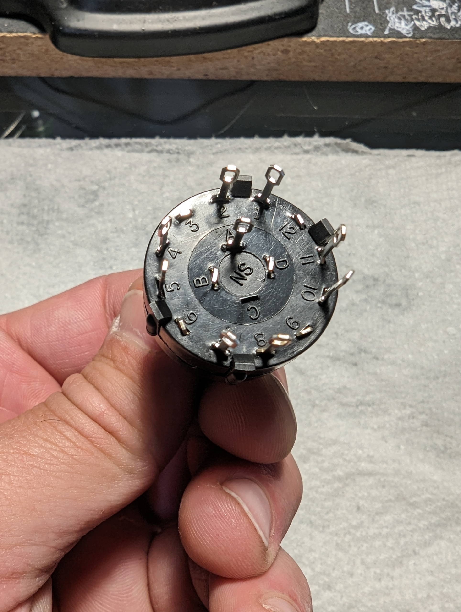

*RotarySwitch1*

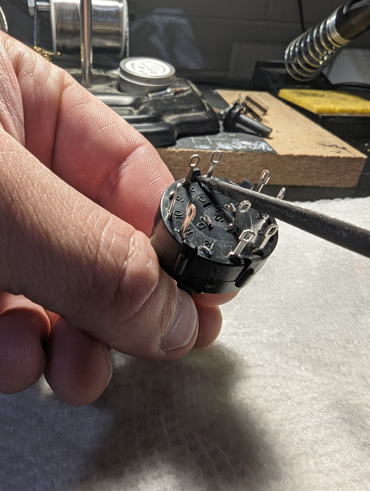

*RotarySwitch2*

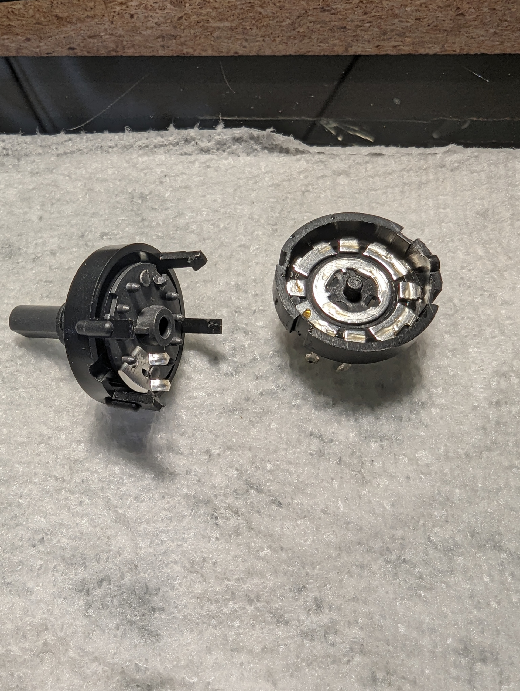

*RotarySwitch3*

> [!WARNING]
> Do not move the stem from the top housing. There are two ball bearings held under spring tension.

## Step 2: Stem Removal

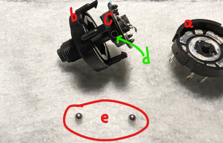

*RotarySwitch4*

Cup the housing with the palm of your hand and remove tension on the stem by slowly pushing it through the housing.

As soon as the base of the stem clears the housing, the ball bearings under spring tension will shoot out.

The rotary switch is comprised of five main components:

| Label | Component |
| --- | --- |
| A | Bottom housing |
| B | Top housing |
| C | Stem |
| D | Spring |
| E | 2x ball bearings |

## Step 3: Rotation Stop Removal

Remove the two plastic tabs, one located on the stem and one located inside the top housing, by whatever means suitable.

It is recommended to use flush snips, razor blades, or even nail clippers, but it is possible to sand or file the tabs down. Ensure a clean, smooth surface to prevent additional friction or snagging.

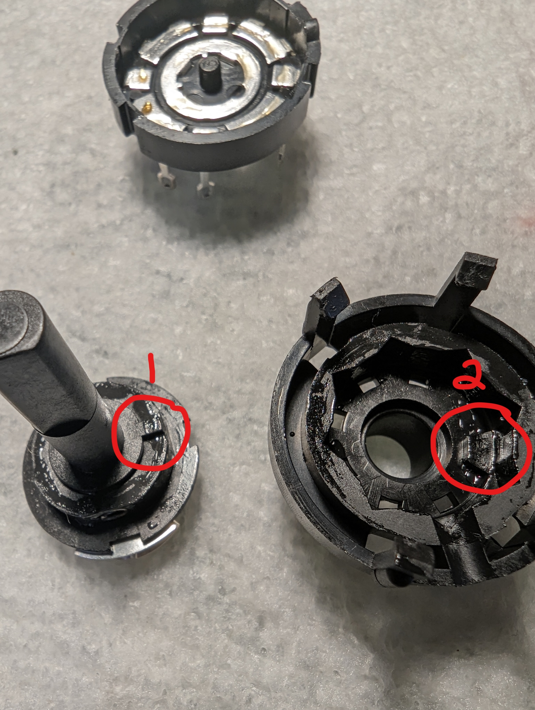

*RotarySwitch5*

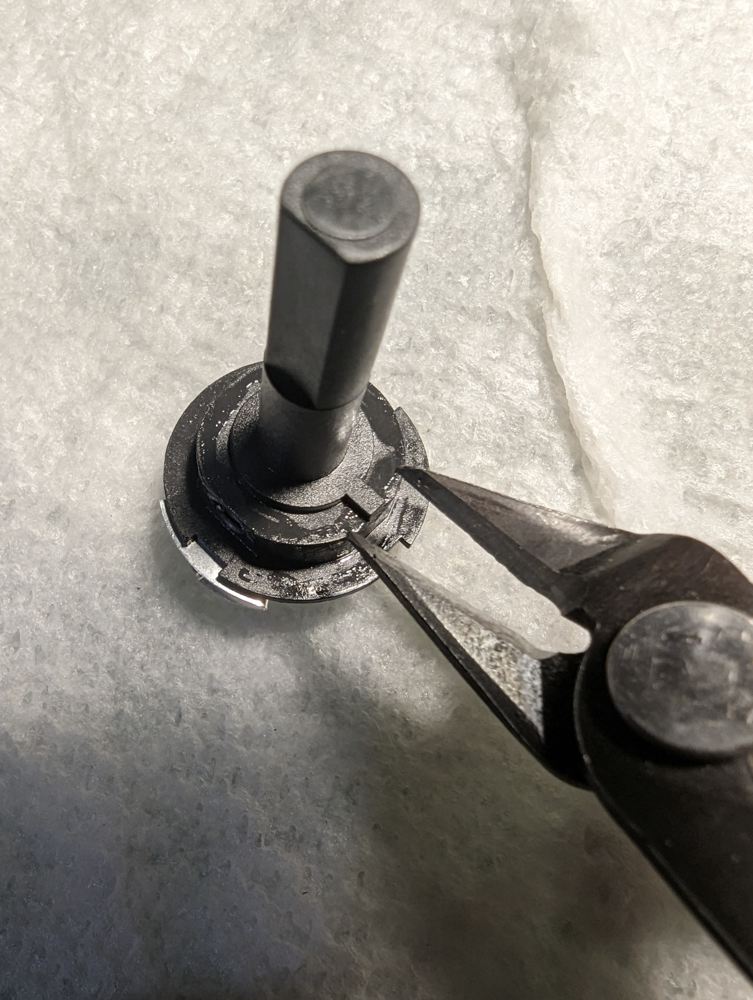

*RotarySwitch6*

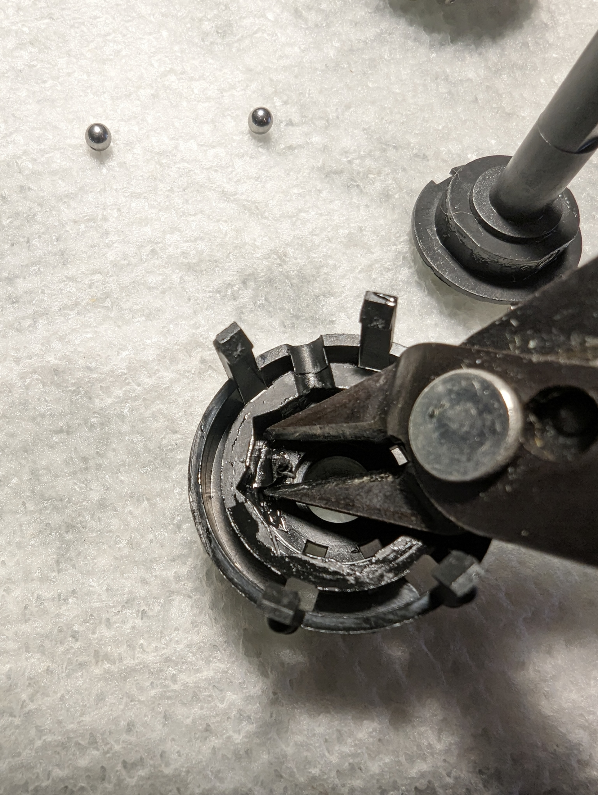

*RotarySwitch7*

## Step 4: Switch Reassembly

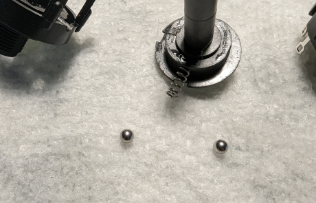

*RotarySwitch8*

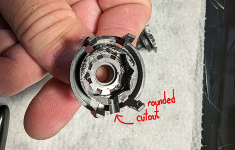

*RotarySwitch9*

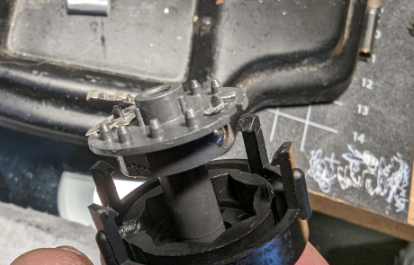

*RotarySwitch10*

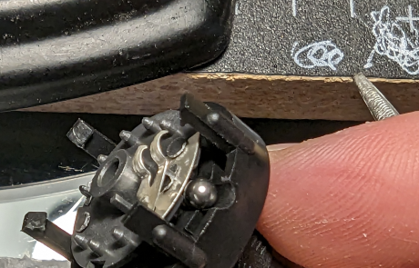

*RotarySwitch11*

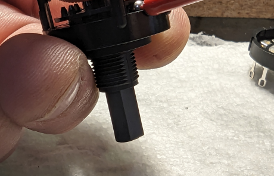

*RotarySwitch12*

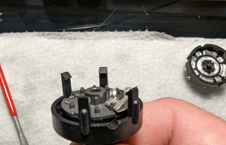

*RotarySwitch13*

1. Insert the spring back into the stem, and then slide the stem back through the top housing.
2. Rotate the stem so the spring is parallel with the rounded cutout on the upper housing.
3. Insert a ball bearing into the spring opposite the side of the cutout.
4. Push the stem all the way into the housing to secure the backside ball bearing, and insert the second ball bearing into the rounded cutaway portion.
5. While maintaining downward pressure on the stem, use the backside of a pen, marker, or other object to push the ball bearing into the spring. Once it clears the cutout, the stem will collapse and secure the bearings in place.
6. The stem should now sit flush. Place the bottom housing back on and ensure the clips are secured under their own tension. Then test it.

## Step 5: Testing

1. Spin the switch, ensuring all detents are felt and the switch travels smoothly through the entire range of movement.
2. Verify continuity of each position with a multimeter or similar tool.

Congratulations. You have now successfully converted your switch to a 4-position, 90° throw, continuous rotation switch.

## License

OpenHornet’s works are licensed under a [Creative Commons Attribution-NonCommercial-ShareAlike 4.0 International License](https://creativecommons.org/licenses/by-nc-sa/4.0/).

Attribution information:

- Name: OpenHornet
- URL: <https://www.OpenHornet.com>
- Email: <webmaster@openhornet.com>
