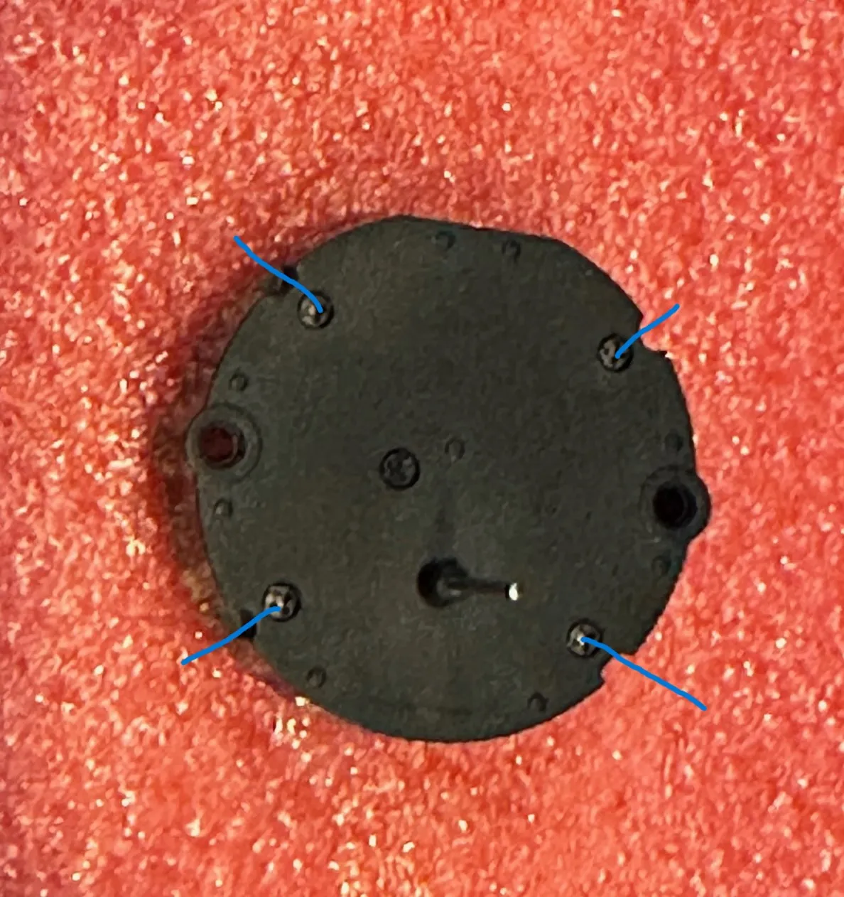
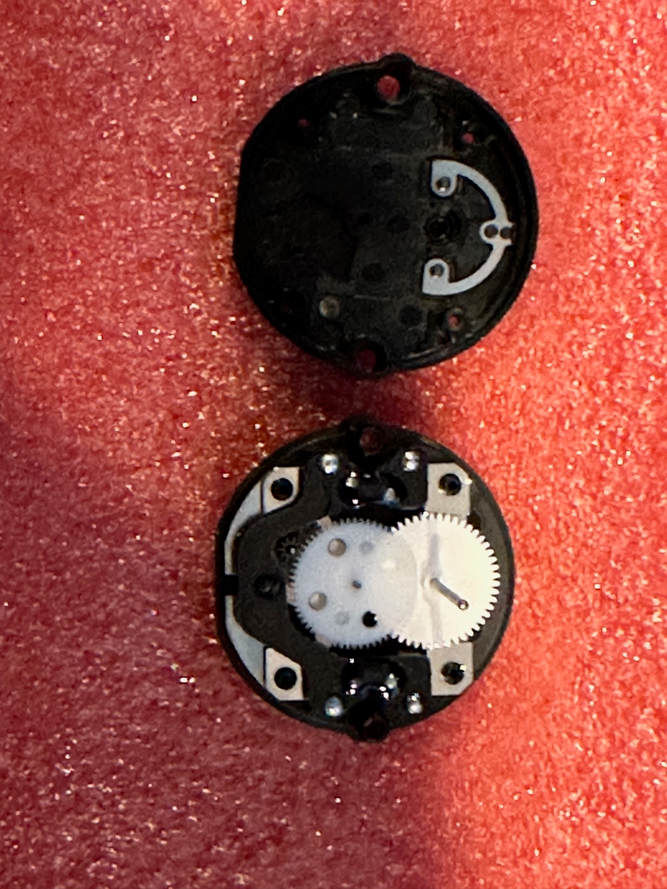
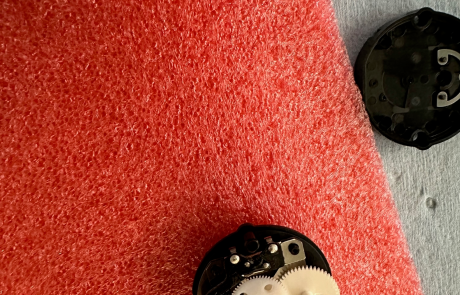
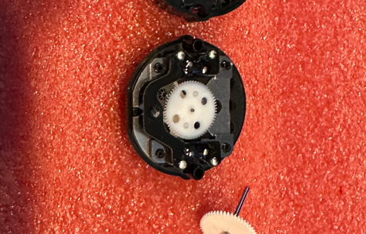
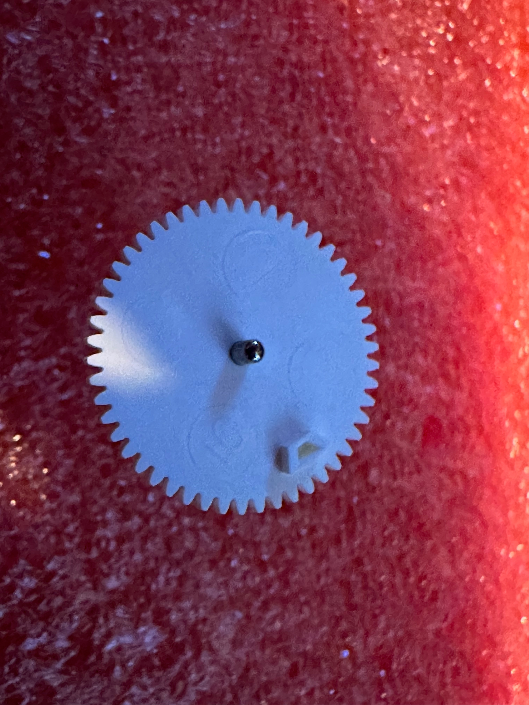
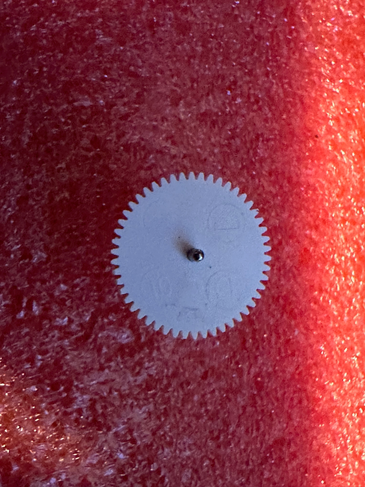
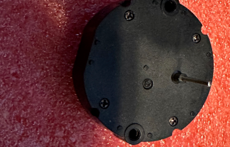

# Modify Gauge Steppers for 360° Travel

> Originally published on OpenHornet.com on 2023-10-29.  
> Submitted by OpenHornet Dev Tester/Builder **Krikeee**.

Various instruments within the simulator, as denoted on their respective drawings, such as OHC007-1, require a modification to allow the gauge stepper motor to have continuous travel. Fortunately, the most common variants of these little stepper gauges can be easily modified, relying instead on external electronics to give zero position.

The motor is the **VID29-02P** motor. Be careful, do not use too much force, and take your time.

## Tools & Materials Required

1. [VID29-02P Gauge Stepper Motor](https://www.amazon.com/)
2. Small Phillips head screwdriver
3. X-Acto/hobby knife with a near clear blade
4. Jeweler/needle file
5. Tweezers

## Step 1: Housing Disassembly

1. On a soft surface, orient the stepper motor with the shaft side up. See Image 1.
2. With the small screwdriver, remove each of the four screws holding on the cover.
3. Remove the cover, being careful not to jar anything loose. It should come off easily, leaving the shaft and gears visible. See Image 2.

Be sure not to bend the pins on the underside of the motor.

## Step 2: Shaft & Gear Removal

1. Using the tweezers or your fingers, grasp the metal shaft and lift gently. It will pull up the gear it is attached to and slightly lift the gear on top of it.
2. Slide the shaft and its gear out from beneath the top gear, tilting it slightly if needed. See Images 3 and 4.

## Step 3: Rotation Stop Removal

1. Using the hobby knife, carefully remove the small stop on the underside of the shaft gear. See Image 5.
2. Removing small slices at a time seems to work better than trying to cut the entire bit off at once.
3. When done, ensure there is a smooth surface where the stop was located. See Image 6.

Alternatively, you could use flush snips, razor blades, nail clippers, or just sand/file it down. The important thing is to ensure a clean, smooth surface to prevent additional friction, snagging, or lost motor steps.

## Step 4: Motor Reassembly

1. Carefully replace the shaft and attached gear by slipping it back under the top gear.
2. Lift as needed to get the shaft seated back into the hole.
3. Gently spin the gears to ensure they are all engaging correctly. Be careful not to dislodge them.
4. Slide the cover back over the shaft and ensure it is flush with the rest of the housing.
5. Screw in the four screws and tighten. Be careful not to overtighten them. See Image 7.
6. Label or otherwise mark the motor so you know it has been modified, since there will be no external indication of the modification.

## Source

Original tutorial: <https://openhornet.com/2023/10/29/360-travel-modification-of-gauge-steppers/>
