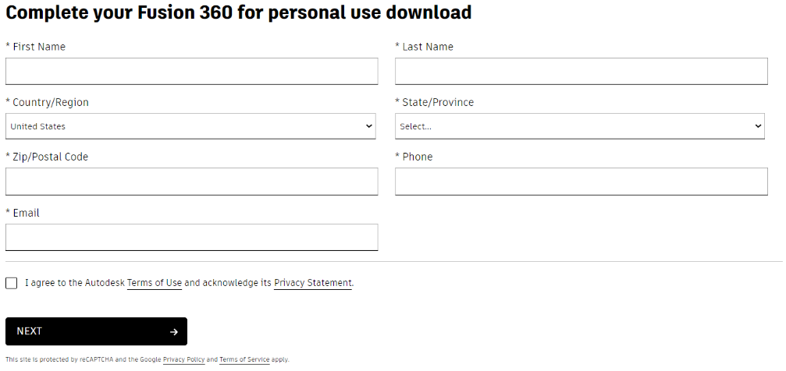
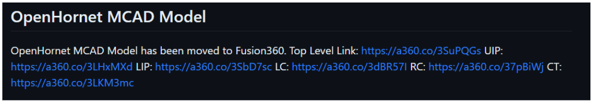
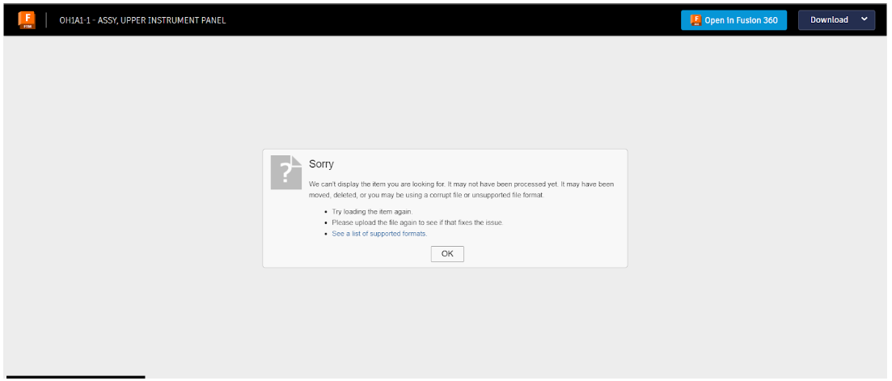
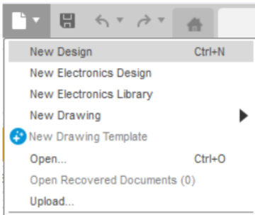
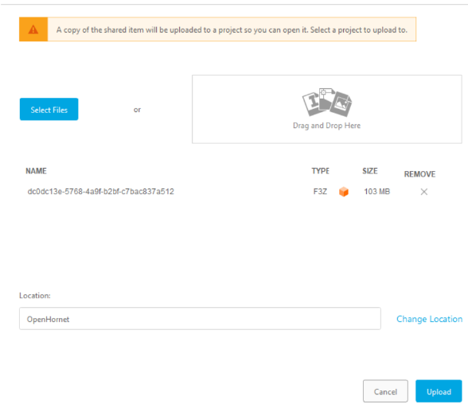

# Downloading and Importing OpenHornet Fusion 360 Models

Do you need to download the OpenHornet Fusion 360 models to modify something, make non-standard manufacturing files, or just look at something from a different angle than the drawings in the build package show? This tutorial walks through importing the OpenHornet models into a personal installation of Autodesk Fusion 360.

If you do not yet have Fusion 360 registered and installed on your computer, start at [Step 1: Download Fusion 360](#step-1-download-fusion-360). If Fusion 360 is already installed and registered, skip to [Step 2: Download OpenHornet Models](#step-2-download-openhornet-models).

For help along the way, ask in the `#fusion360` channel on the OpenHornet Discord server.

> Credits: jkkicks for the initial writeup, Sandra for the GitHub markup conversion and initial editing.

## Step 1: Download Fusion 360

1. All MCAD files for the OpenHornet project are currently managed through Autodesk Fusion 360. If you do not already have a license, go to the [Autodesk Fusion 360 personal use page](https://www.autodesk.com/products/fusion-360/personal).
2. Scroll down on the page and click **Get Started**. See Figure 1.
3. Fill out the form on the next page to register your account for the personal use version. See Figure 2.
4. After clicking **Next**, a download page will appear. Click the download link.
5. Once the Fusion 360 installer has finished downloading, run the installer and follow the on-screen instructions to finish downloading and installing Fusion 360 for personal use.

*Figure 1 - Get Started*

*Figure 2 - F360 Registration Form*

## Step 2: Download OpenHornet Models

The OpenHornet CAD models can be imported into Fusion 360 directly from the [OpenHornet GitHub repository](https://github.com/jrsteensen/OpenHornet). Scroll down on the repository main page until the Fusion 360 model links are displayed.

*Figure 3 - Fusion360 Model Links*

Each link contains the required models for a major portion of the current project version. The models are split into the following subgroups:

| Model / Assembly | Description |
| --- | --- |
| Top Level | Complete top level assembly for OpenHornet. |
| Upper Instrument Panel (UIP) | Models for the UIP. |
| Lower Instrument Panel (LIP) | Models for the LIP. |
| Left Console (LC) | Models for the LC. |
| Right Console (RC) | Models for the RC. |
| Center Tub (CT) | Models for the CT. |

Clicking one of these links will take you to an Autodesk Fusion archive page. Some pages, especially the Top Level model, may have trouble loading or may show an error outright. This is normal for a project of this size and is a Fusion 360 limitation, not an OpenHornet limitation. See Figure 4.

*Figure 4 - Large Assembly Error Page in A360 Web Interface*

Click **Open in Fusion 360** in the top right of the web interface.

Be patient. The site may show another error stating **Fusion 360 not detected**. This is usually caused by the browser not being able to detect the new installation. You can open Fusion 360 in the background or try another browser. If the problem persists, ask in the `#fusion360` channel on the OpenHornet Discord server.

Once the files are transferred to your Fusion 360 installation, a pop-up window will ask where you would like to upload the models in your personal account.

It is recommended that you create a dedicated **Project** to store all the models, with an individual folder for each OpenHornet assembly. You can create projects and folders by clicking **Change Location** near the bottom of the screen.

> We recommend not naming the project `OpenHornet` in case you later become an OpenHornet contributor. That helps avoid confusion or conflicts with direct access to the official project.

## Alternate Download Method: `.f3z` Archive File

1. The models can also be downloaded as a Fusion 360 archive file (`.f3z`). Click **Download** in the top right corner of the website and select **Fusion 360 Archive**.
2. Once again, patience is key. The `.f3z` file will be compiled and emailed to the supplied email address. After downloading it to your computer, import it into Fusion 360 by clicking the file icon in the top right corner of the Fusion 360 application, then clicking **Upload...**.
3. When the **Upload** window opens, select the newly downloaded `.f3z` file, designate a project and folder, then click **Upload**. The window may need to be moved so the **Upload** button at the bottom is visible.

Either upload process can take anywhere from 5 minutes to 2 hours from start to finish, depending on your internet connection and the specific assembly model being uploaded. Fusion 360 may also be unresponsive while showing no indication that it is doing anything. This is a Fusion 360 issue, not an OpenHornet issue.

If the Fusion 360 window shows **Not Responding** and the mouse cursor is spinning, that is normal. Grab a coffee. It might be a short while. It is probably going to be a long while, but we are trying to make you feel better.

*Figure 5 - Upload Command location in F360*

*Figure 6 - Upload Dialog Box*

Eventually, a **Job Status** window will appear, showing the current upload progress for each individual model in the assembly. This is the part that takes the longest. Patience is key.

## Publishing Notes

This Markdown version was prepared for migration from the OpenHornet website to GitHub. Image links are relative and intended to work when this file and the `images/` folder are committed together.

The original website page exposes the article text and the main Fusion 360 logo image through the accessible page view. The six inline figure screenshots were represented in the accessible output only by their captions, so placeholder SVG files were included with the correct filenames and captions. Replace those six SVG placeholders with the original screenshots before publishing.
