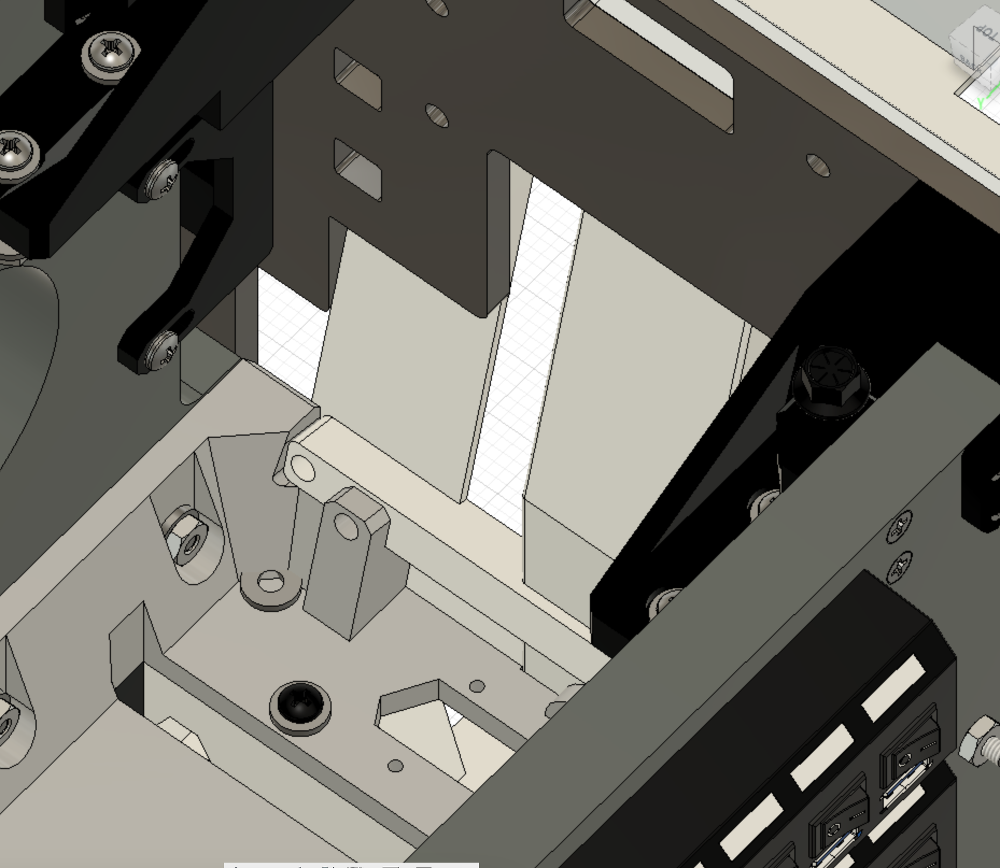

# OH1 Modification for Winwing integration
- **Author:** J Schumacher (Ulukaii) 
- **Contributed on:** Oct 13, 2024 
- **Derived from:** v0.3.0
- **Original Assembly:** OH1, OH2A3

## Summary
This folder provides modifications for integrating the Winwing MIP into the OpenHornet upper and lower instrument panel (UIP and LIP). It is aimed at builders who intend to do a full Winwing MIP integration, including HUD panel. The parts provided herein are designed with 3D printability in mind. 
- Folder V1: Previous release. Not continued
- Folder V2: Current stable build.

## How to use this mod

Use this mod to build your pit using the basic OpenHornet upper instrument control panel (UIP) frame, but integrate your Winwing MIP components into the build. You will replace the following visible parts: Left DDI, right DDI, UFC, HUD control panel and AMPCD. To achieve this, this mod provides the files for a modified face plate (acrylic) and modified brackets (3D printed). 

## Feature overview

The integration positions the Winwing UFC and HUD panels as closely as possible to the OH-specified position:

Due to the Winwing MFD screen encasings, the face plate can't use six screws on the outboard longeron. However, the assembly provides new / alternative securing. The main holding bracket is firmly secured using M5 screws and six heat inserts: 

The lower central brackets are modified to support and secure the main holding bracket:

The BIT box is open on the lower side, providing (some) access to the extra buttons on the Winwing UFC:

Use at your own risk. OpenHornet license terms apply. Have fun!

## Character of this mod

To integrate the Winwing MIP into OpenHornet, several design choices had to be made. This is due to the fact that the Winwing MFD bezels are larger and that the Winwing HUD panel comes with the HDG and CRS knobs directly attached to it. The existing solutions by the community follow different design choices. The following table provides an overview of this mod and the other Winwing integration mod by Nick, to help you decide which one to pick.

|                        | Ulukaiis mod (this mod) | Nicks mod |
|------------------------|---|---|
| Idea                   | Reasonable effort integration w/ only 8 modified parts. No custom PCBs required | High fidelity integration with customized eyebrow panels. Requires custom PCBs |
| Resulting architecture | MFD screens extend further downwards by 1.5 cm compared to OH spec | MFD screens extend further upwards, EWI panels are reduced in size and custom design |
| MFD screens            | Winwing as-is | Winwing, encasing removed |
| UFC                    | Winwing    | Winwing    |
| EWIs                   | OpenHornet | Custom     |
| HUD panel              | Winwing    | OpenHornet |
| HDG/CRS sel            | Winwing    | OpenHornet |
| AMPCD                  | Winwing    | N/A        |

## Manufacturing parts list
1. ACRL_OH1A1-12_MOD_A: Completely redesigned face plate (acrylic). Replaces OH1A1-12
2. FDM_OH1WW-01: NEW part that provides the mounting plate between face plate and Winwing UFC and HUD panel
3. FDM_OH1WW-02: NEW part that provides encasing for the Winwing UFC
4. FDM_OH1A8A4-10_MOD_A: modified upper box (BIT box) for the UFC including the go/no-go lights. Comes with an additional cable guide. Replaces OH1A8A4.
5. FDM_OH2A3A1-10_MOD_A: this is a modified holder for the AMPCD without the HDG / CRS knobs and with positioniing of the AMPCD harmonized with the UIP Winwing installation
6. FDM_OH1A1-23: this is a modified HUD panel aft support 
7. FDM_OH1A1-19: this is a modified MFD panel lower support (you need to print two of them)
8. FDM_OH!A1-22: this is a modified version of the display pressure foot. Instead of pressing the display, it is now an additional fastening position for the face plate.

## Additional required COTS parts list (diff to OH)
1. Winwing MIP including three MFDs, three screens, UFC and HUD panel
2. 8 M3 screws, 42mm, to fasten the MFD screens to the face plate. Exact length depends on your face plate thickness
3. 8 M3 hex nuts (usually included in your MIP)
4. 6 M5 screws, 12mm, to fasten the UFC to the UFC mount (FDM_OH1WW-02)
5. 6 M5 screws, 12mm, to fasten the UFC mount to the face plate (ACRL_OH1A1-12_MOD_A)
6. 6 M5 heat inserts for the UFC mount
7. 2 M5 screws, 12mm, to fasten the HUD BIT box (FDM_OH1A8A4-10) to the face plate
8. 1 M5 screw , 30mm, to fasten the HUD BIT box (FDM_OH1A8A4-10) to the UFC box cover (OH1WW-02)
9. 1 M5 heat insert, to fasten the HUD BIT box (FDM_OH1A8A4-10) to the UFC box cover (OH1WW-02)
10. 4 M5 screws, 20mm, to fasten the AMPCD to the AMPCD box

## Additional required mechanical changes to the OH parts
1. To fit the Winwing DUs, you will need to perform small cutouts into the outboard UIP longerons. The exact size depends on the thickness of your material. You will see it when you start integrating it

2. The upper outward corner of the DU will intersect with the ABS glareshield. You will need to provide some cutouts for these corners as well. 

## How to assemble
1. Prepare the UIP frame: remove the old face plate (if any) and install the modified OH1A1-25 (central bracket) and OH1A1-19 (WW MFD lower supports).
2. Assemble the whole MIP to the face plate, including left and right DDIs.
3. Take the assembly and mount it to your prepared UIP structure
4. Connect cables
5. Install the UFC box cover (OH1WW02) by sliding it in from above
6. Install the UFC HUD Bit box and cover.

## Known issues
- Outboard fastening of the face plate should be improved

## Further links
 - Openhornet.com
 - https://github.com/eHanseJoerg/OpenHornet/tree/develop/release (author OH repo)
 - https://makerworld.com/de/models/650441 (Makerworld repo for ease of access)

